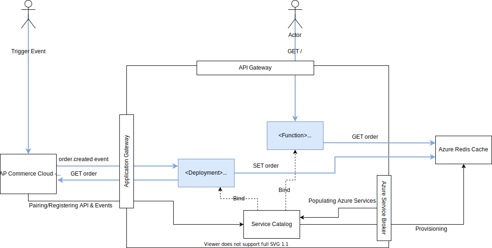

# hello-kyma
Simple hello kyma python Flask application for Kyma.

<p align="center">
 
</p>

# Requirements

- git available by `brew install git`
- kubectl available by `brew install kubernetes-cli`
- docker available by browsing https://hub.docker.com/editions/community/docker-ce-desktop-mac
- test that docker works by calling `docker run --rm -p5000:5000 hello-kyma:backup`
- phyton available by `brew install python`

# Local Development
Checkout this repo
```
git clone https://github.com/a-thaler/hello-kyma.git
```

Browse into the repository
```
cd hello-kyma
```

Run it locally using python
```
python3 app/main.py
```

# Docker creation and upload
Build a docker image
```
docker build -t hello-kyma:latest .
```

(Optional) Run the docker image locally
```
docker run --rm -p5000:5000 hello-kyma:latest
```

Login to docker hub
```
docker login
```

Tag and upload the docker image
```
docker tag hello-kyma:latest athaler/hello-kyma:latest
docker push athaler/hello-kyma:latest
```

# Kyma Deployment

Have the kubeconfig placed in `~/.kube/config`

Main deployment
```
kubectl apply -f kyma/deployment.yaml
```

API Exposure
```
kubectl apply -f kyma/api.yaml
```

Create service bindings
```
kubectl apply -f kyma/servicebinding.yaml
```

Create event bindings
```
kubectl apply -f kyma/eventbinding.yaml
```

Create lambda for verification
```
kubectl apply -f kyma/lambda.yaml
```